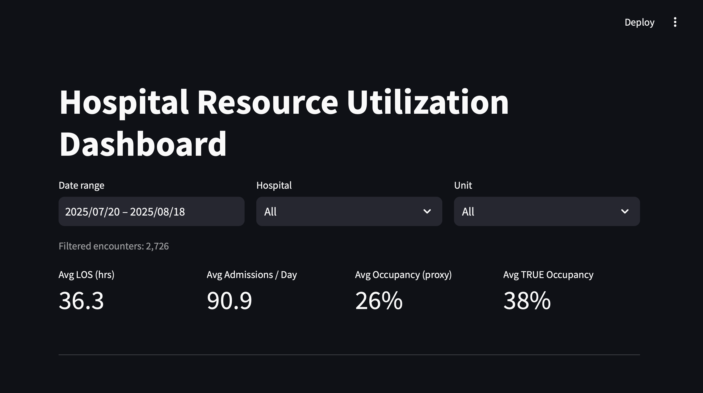
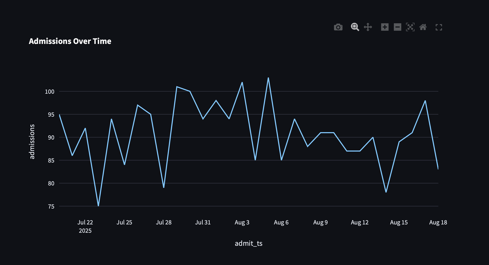

# 🏥 Hospital Resource Utilization Dashboard  

An **interactive data analytics dashboard** built with **Python (Streamlit, Pandas, Plotly)** and **SQLite** to simulate real-world hospital operations monitoring.  
This project demonstrates skills in **data engineering, data visualization, and healthcare analytics** by analyzing synthetic patient admissions, staffing, and bed capacity data.



---

## 🔑 Features
- **Filter-aware SQL queries** (date range, hospital, unit) for efficient data access  
- **KPIs**:  
  - Average Length of Stay (LOS)  
  - Average Admissions/Day  
  - **Occupancy** (proxy vs. true daily census)  
  - Bottleneck detection (≥ 85% occupancy)  
- **Interactive visualizations**:  
  - Admissions over time (line chart)  
  - Average LOS by unit (bar chart)  
  - ED wait times by triage level (bar chart)  
  - Daily TRUE occupancy % (line chart)  
- **Drill-down encounter table** with CSV export  
- **Data quality awareness**: synthetic data includes duplicates, nulls, and noisy values to simulate real healthcare datasets  
- **Auto-bootstrap**: creates `hospital.db` from CSVs on first run  

---

## 🗂 Data Sources (Synthetic)
All datasets are generated for demonstration only and stored in `/data`:
- `patients.csv` – Patient demographics and primary condition  
- `admissions.csv` – Encounter-level records with timestamps, triage level, LOS  
- `staff.csv` – Scheduled staff counts per hospital/unit/shift/day  
- `bed_capacity.csv` – Baseline staffed beds by hospital/unit  
- `units.csv` – Reference table of units (ED, MED, SURG, ICU)  

---

## 🚀 Quick Start
### 1. Clone the repo
```bash
git clone https://github.com/ThuneKyaeSinSu/hospital-dashboard.git
cd hospital-dashboard
```
### 2. Install dependicies
```bash
pip install streamlit pandas numpy plotly python-dateutil
```
### 3. Run the app
```bash
streamlit run app_streamlit.py
```